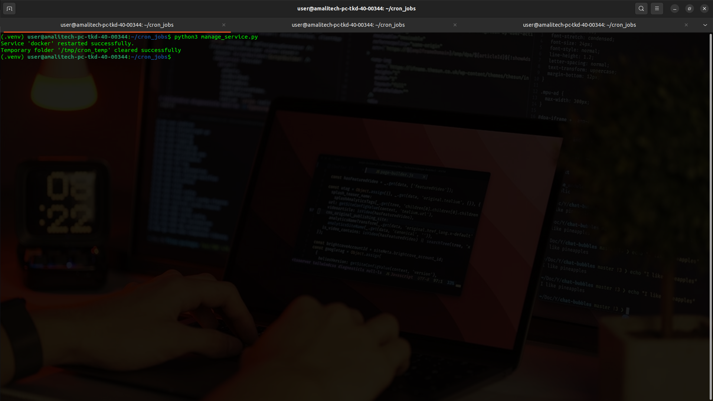
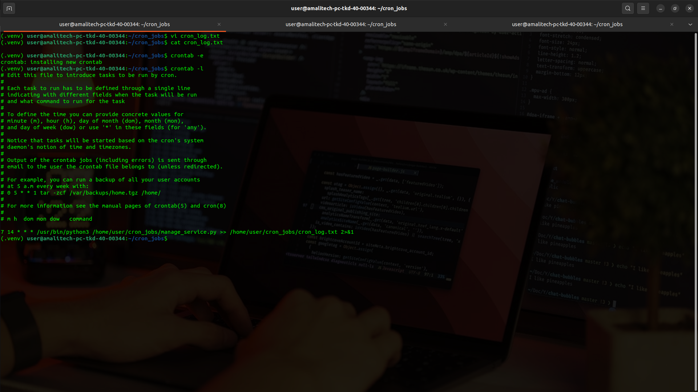

# Python Cron Job for Service Management and Temporary Folder Cleanup

## Overview

This provides a step-by-step guide to setting up a Python script as a cron job on a Unix-based system. The script performs two task:

- Restarts a specified system service
- Clears a specified temporary folder

The cron job will run the script at a specific interval, ensuring automated management of the system service and cleanup of temporary files.

## Prerequisites

- A Unix-based operating system (Linux or MacOS).
- Python installed on the sytem.
- Sufficient permissions to manage services and set up cron jobs
- Basic knowledge of cron and Python scripting

## Objectives

1. Create a Python that:
   - Restarts a system service
   - Clears a specified temporary folder.
2. Set up a cron job to run the script at scheduled intervals.

## Steps

**Step 1: Create the Python Script**

1. Open your terminal and create a directory to store the Python script:

```
mkdir ~/cron_jobs
cd ~/cron_jobs
```

2. Create a new Python file (You can use any text editor but I'm using Neovim):

```
nvim manage_service.py
```

3. Add the following code to `manage_service.py` code available at [manage_service](manage_service.py)
4. Save and close the file:
   - In Neovim, press `:wq` and `ENTER`

**Step 2: Make the Script Executable**

1. Make the Python script executable:

```
chmod +x manage_service.py
```

**Step 3: Test the Script**

1. Run the script manually to ensure that it works as expected:

```
python3 manage_service.py
```


**Step 4: Set Up the Cron Job**

1. Install crontab using pip:

```
pip3 install python-crontab
```

2. Open the crontab with your preferred edior:

```
crontab -e
```

 3. Add the following cron job entry:

```
0 2 * * * /usr/bin/python3 /home/your_username/cron_jobs/manage_service.py >> /home/your_username/cron_jobs/cron_log.txt 2>&1
```

- Where:
  - `0 2 * * *`: Specifies that the job will run daily at 2:00 AM.
  - `/usr/bin/python3`: The path to the Python3 interpreter (adjust this if Python is installed elsewhere).
  - `/home/your_username/cron_jobs/manage_service.py`: The full path to the Python script.
  - `>> /home/your_username/cron_jobs/cron_log.txt`: Appends both standard output and error messages to `cron_log.txt` for logging
  - `2>&1`: Redirects error messages to the same file as standard output

4. Save and close the crontab

**Step 5: Verify the Cron Job**

1. List all cron jobs to confirm the new entry is saved:

```
crontab -l
```

2. Check the log file after the scheduled time to verify that the script ran:

```
cat /home/your_username/cron_jobs/cron_log.txt
```
